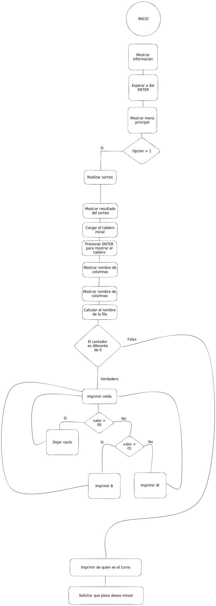

# Práctica 3 - Damas Chinas

## Introducción
El juego consiste en un tablero de 9x9 posiciones. Cada jugador dispone de 10 fichas, además de que únicamente serán dos jugadores, para decidir quién empieza la partida, el programa elegirá de manera aleatoria al jugador que empieza. El objetivo es llevar todas las piezas al lugar de donde están las piezas del contrincante originalmente.

## Diagrama de flujo
Se muestra a continuación el diagrama de flujo del programa para poder ejecutarse correctamente:



## Macros
```asm
; Macros
printMsg macro str
            mov dx, offset str ; dx = offset de la cadena
            mov ah, 09h        ; imprimir cadena
            int 21h            ; imprimir cadena
endm

macroPrintPiece macro piece
            printMsg dobleSignoMayor
            printMsg piece
            printMsg dobleSignoMenor
endm
```

Estos macros sirven para imprimir mensajes por pantalla, y para imprimir las piezas del tablero.


## Configuración del programa
```asm
; Configuración del programa
.MODEL small
.STACK
.RADIX 16 ; para que los números se muestren en hexadecimal
dimension EQU 09 ; Tamaño del tablero
optionLong EQU 20 ; Tamaño de la opción del menú
.DATA
```

- La directiva model small, indica que el programa se ejecutará en modo real.
- La directiva stack, indica que el programa usará la pila.
- La directiva radix 16, indica que los números se mostrarán en hexadecimal.
- La constante dimension, indica el tamaño del tablero.
- La constante optionLong, indica el tamaño de la opción del menú.
- La directiva data, indica que se declaran variables.

### Estructura del código
El código está escrito en ensamblador para procesadores x86, específicamente para la plataforma DOS. El código se divide en varias secciones:

- La sección start es la entrada principal del programa, donde se cargan las direcciones de inicio de la sección de datos y se llama a la función wait_enter para esperar a que el usuario presione la tecla ENTER antes de mostrar el menú principal.
- La sección mainMenu muestra el menú principal del juego, donde el usuario puede elegir una de las tres opciones disponibles. El programa lee la entrada del usuario y realiza las acciones correspondientes según la opción elegida.
- La sección wait_enter espera a que el usuario presione la tecla ENTER antes de continuar.
- La sección start_game es la función principal que se llama cuando el usuario elige la opción de iniciar el juego. En esta sección se realiza un sorteo para determinar qué jugador comienza y se muestra un tablero vacío para empezar el juego.
- La sección upload_game es la función que se llama cuando el usuario elige la opción de cargar una partida guardada. Esta sección no está implementada y solo hace un salto a la sección exit para salir del programa.
- La sección generate_random_number es una subrutina que genera un número aleatorio entre 0 y 1 tomando las milesimas de segundo del sistema. Este número se utiliza para determinar qué jugador comienza el juego.
- La sección generate_piece_random es una subrutina que genera un número aleatorio entre 0 y 1 tomando las milesimas de segundo del sistema. Este número se utiliza para determinar qué piezas son las blancas y cuáles son las negras.
- La sección set_piece_B es una subrutina que se llama cuando se sortean las piezas y se determina que las negras son las del jugador B. Se encarga de imprimir el símbolo de la pieza negra en la pantalla.
- La sección set_piece_W es una subrutina que se llama cuando se sortean las piezas y se determina que las blancas son las del jugador B. Se encarga de imprimir el símbolo de la pieza blanca en la pantalla.

### Funcionamiento del programa
Cuando se ejecuta el programa, se muestra un mensaje de bienvenida y se espera a que el usuario presione la tecla ENTER para mostrar el menú principal. Si el usuario elige la opción de iniciar el juego, se realiza un sorteo para determinar qué jugador comienza y se muestra un tablero vacío. Si el usuario elige la opción de cargar una partida guardada, el programa simplemente hace un salto a la sección exit para salir del programa. Si el usuario elige la opción de salir del programa, el programa termina.

- La función start_sequence es el punto de entrada del programa. Esta función imprime la primera y segunda línea del tablero de ajedrez, llama a la función fill_initial_table para llenar el tablero con las piezas iniciales, llama a la función printTable para imprimir el tablero, llama a la función printTurn para imprimir el turno del jugador, solicita al usuario que seleccione una pieza para mover, solicita al usuario que coloque una pieza en el tablero, cambia el turno del jugador y repite el proceso.

- La función printTable se encarga de imprimir el tablero en la pantalla. Esta función utiliza un bucle para imprimir cada una de las celdas del tablero. Para cada celda, la función determina si está vacía o si contiene una pieza de un jugador y, en ese caso, qué pieza es. Luego, la función usa interrupciones del sistema para imprimir la letra correspondiente a la pieza en la celda.

- La función changeTurn cambia el turno del jugador actual. La función obtiene el valor actual del turno del jugador y lo cambia para que sea el turno del otro jugador.

- La función putPieceInTable solicita al usuario que coloque una pieza en el tablero. La función utiliza interrupciones del sistema para leer la entrada del usuario y determinar la posición deseada para la pieza. Luego, la función coloca la pieza en la posición deseada en el tablero.

- El código proporcionado también contiene algunos comentarios adicionales que explican cómo funcionan ciertas partes del código. Estos comentarios pueden ser útiles para comprender mejor el código.
