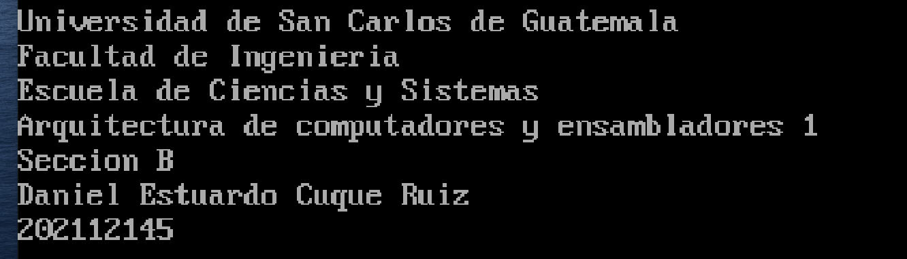
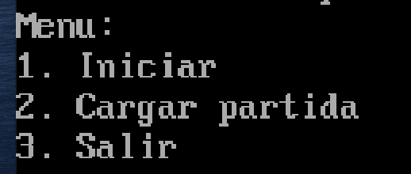
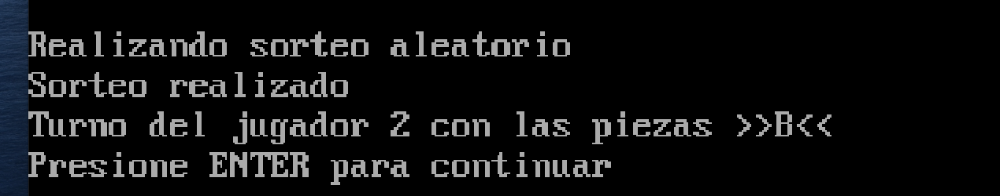
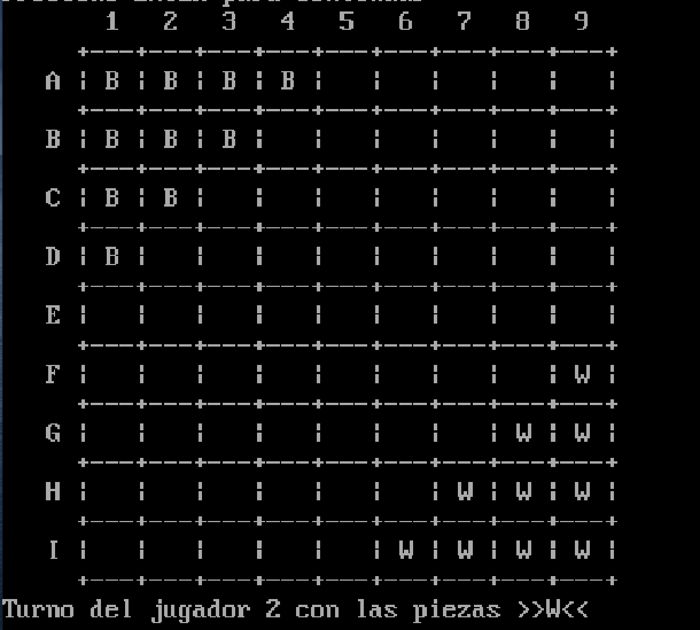

# Práctica 3 - Damas Chinas
 
## Introducción
El juego consiste en un tablero de 9x9 posiciones. Cada jugador dispone de 10 fichas, además de que únicamente serán dos jugadores, para decidir quién empieza la partida, el programa elegirá de manera aleatoria al jugador que empieza. El objetivo es llevar todas las piezas al lugar de donde están las piezas del contrincante originalmente.

## Requerimientos
Para poder jugar a este juego, es necesario tener instalado un emulador de entorno de sistema operativo DOS (Disk Operating System), como por ejemplo [DOSBox](https://www.dosbox.com/). Además, es necesario tener instalado el compilador de lenguaje ensamblador x86, [MASM](https://www.masm32.com/).

## Instalación
Para poder jugar a este juego, es necesario ejecutar el archivo .EXE llamado `main.exe`que se encuentra en la raíz del proyecto. Para ello, es necesario abrir el emulador de DOSBox y ejecutar el comando `main.exe`.
```bash
main.exe
```

## Uso
Una vez ejecutado el programa, se mostrará el menú principal del juego, en el que se podrá elegir entre las siguientes opciones:
- Iniciar
- Cargar
- Salir

### Iniciar programa
Se mostrará un mensaje de la información del desarrollador



## Menú
El menú tendrá 3 opciones
- Iniciar: iniciará el juego
- Cargar: cargará una partida guardada
- Salir: saldrá del juego


### Iniciar juego
Se realizará el sorteo para ver quién empieza la partida


Se mostrará el

### Movimientos
El jugador podrá mover sus fichas, horizontalmente o verticalmente, no puede comerse a otras fichas pero si puede pasar encima de esas


Se solicitará la pieza que se desea mover, esta tendrá que ser en formato ColumnaFila, por ejemplo, si se desea mover la pieza de la columna F y fila 1, se deberá escribir F1


### Salir del juego
En la tercera opcion del menu, se cerrará la aplicación


